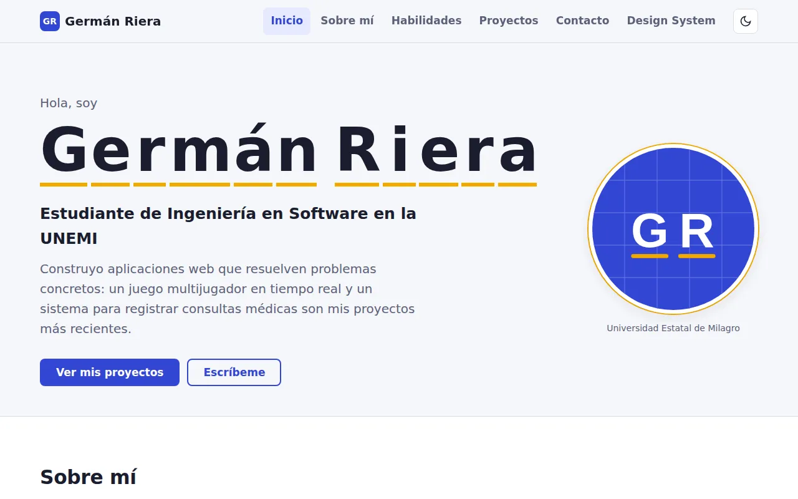
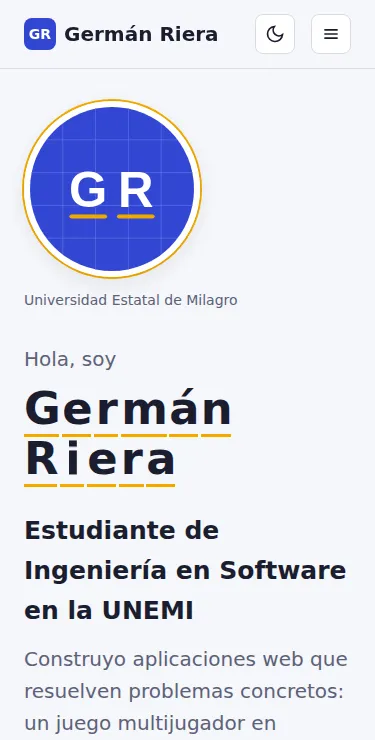
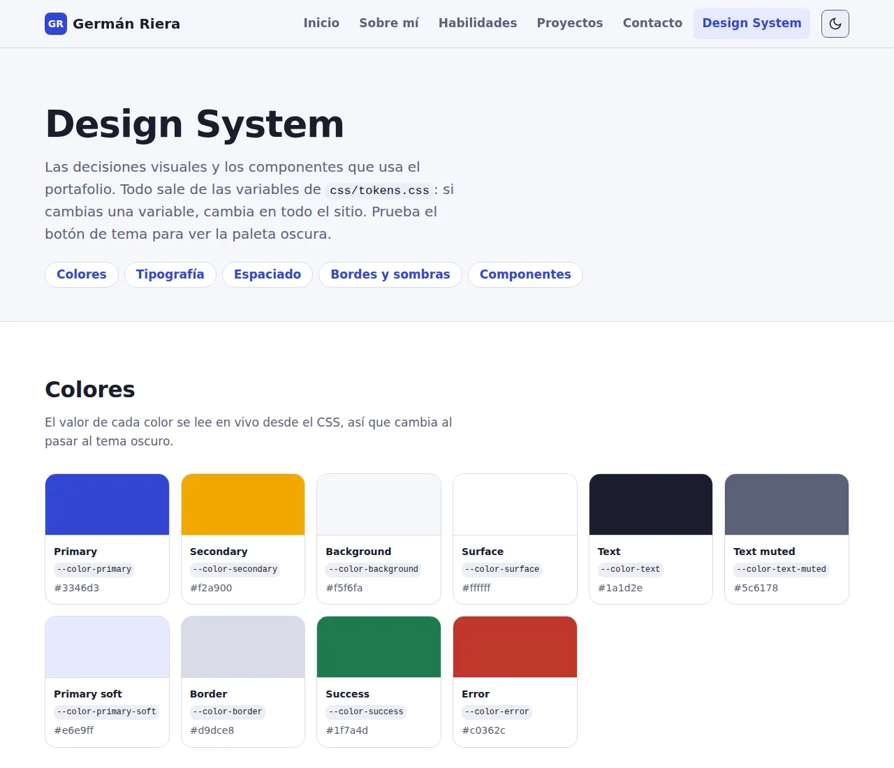

# Portafolio web profesional

Portafolio personal de **Germán Riera**, desarrollador web. Presenta mi perfil, mis habilidades técnicas y mis proyectos destacados, junto con un Design System que documenta los componentes del sitio.

- **Sitio publicado:** https://germanrieraunemi.github.io/Portafolio-web/
- **Repositorio:** https://github.com/GERMANRIERAUNEMI/Portafolio-web



## Tecnologías

- **HTML5 semántico:** `header`, `nav`, `main`, `section`, `article`, `aside`, `figure`, `footer` y `dialog`.
- **CSS propio:** variables (Custom Properties), Grid, Flexbox y media queries. Sin frameworks.
- **JavaScript sin librerías.**
- **Git y GitHub Pages** para el control de versiones y la publicación.

## Secciones

1. **Inicio:** presentación, rol y accesos a proyectos y contacto.
2. **Sobre mí:** descripción, qué hago e intereses.
3. **Habilidades:** agrupadas en Frontend, Backend, Bases de datos y Herramientas, cada una con su nivel.
4. **Proyectos destacados:** tres proyectos con descripción, problema que resuelven, tecnologías, captura y enlaces.
5. **Contacto:** formulario con validación y enlaces profesionales.
6. **Design System** (`design-system.html`): colores, tipografía, espaciados, bordes, sombras y componentes.

## Funcionalidades con JavaScript

| Funcionalidad | Archivo | Para qué sirve |
|---|---|---|
| Tema claro y oscuro con `localStorage` | `js/tema.js`, `js/tema-inicial.js` | Leer cómodo de día y de noche; el sitio recuerda la elección. |
| Menú responsive | `js/navegacion.js` | En teléfonos, el menú se abre con un botón y se cierra con Escape. |
| Navegación dinámica | `js/navegacion.js` | El menú resalta la sección que se está viendo. |
| Botón para volver al inicio | `js/navegacion.js` | Aparece al bajar y lleva al principio de la página. |
| Filtro de proyectos por tecnología | `js/proyectos.js` | Encontrar rápido los proyectos que usan una tecnología. |
| Modal de detalles del proyecto | `js/proyectos.js` | Ver lo que aprendí en cada proyecto sin salir de la página. |
| Validación del formulario | `js/formulario.js` | Mensajes claros junto a cada campo antes de enviar. |
| Animación del nombre | `js/hero.js` | Las letras aparecen como en el juego del ahorcado; se desactiva si el sistema pide menos movimiento. |

## Estructura del proyecto

```
portafolio/
├── index.html              Página principal
├── design-system.html      Design System y componentes
├── css/
│   ├── tokens.css          Variables: colores, tipografía, espaciados, radios, sombras
│   ├── base.css            Reset, tipografía base y utilidades
│   ├── components.css      Componentes reutilizables (botones, cards, badges, modal...)
│   ├── layout.css          Distribución de secciones y responsive
│   └── design-system.css   Estilos exclusivos de la página del Design System
├── js/                     Un archivo por funcionalidad
├── assets/img/             Avatar, favicon y capturas de proyectos
└── docs/                   Capturas para este README
```

## Cómo verlo en tu computadora

1. Clona el repositorio:
   ```bash
   git clone https://github.com/GERMANRIERAUNEMI/Portafolio-web.git
   ```
2. Abre `index.html` en el navegador (doble clic), o usa la extensión **Live Server** de VS Code.

No necesita instalar nada: es HTML, CSS y JavaScript puro.

## Capturas

| Teléfono | Design System |
|---|---|
|  |  |

## Accesibilidad

- Contraste suficiente en ambos temas y foco visible al navegar con teclado.
- Enlace para saltar al contenido, textos alternativos en todas las imágenes y etiquetas en todos los campos.
- Respeta la preferencia del sistema de reducir el movimiento.
